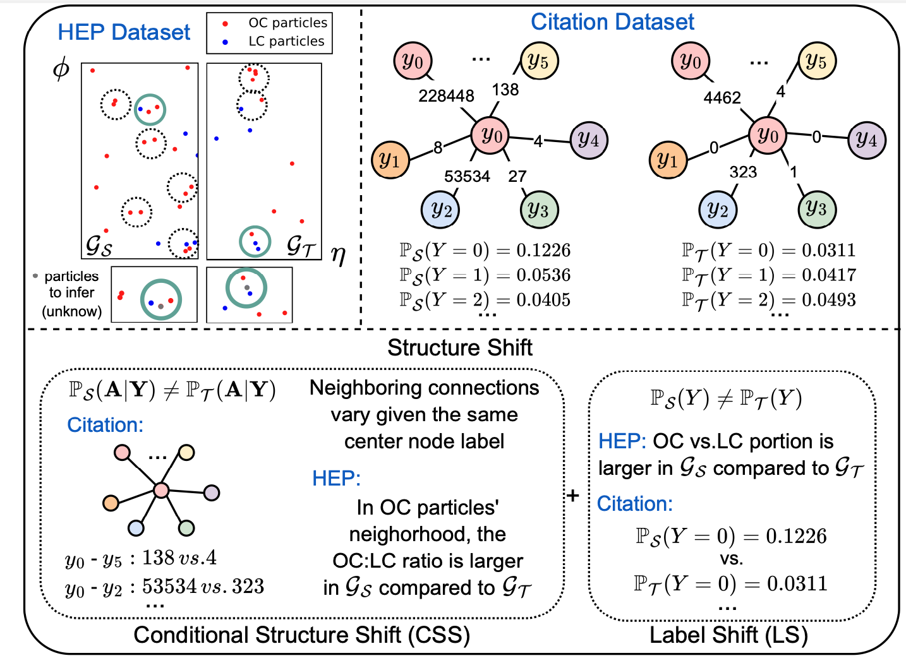
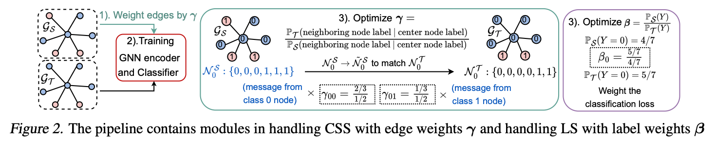

<h1 align="center">Pairwise Alignment Improves Graph Domain Adaptation (Pair-Align)</h1>

This repository is the implementation for the paper Pairwise Alignment Improves Graph Domain Adaptation by Shikun Liu, Deyu Zou, Han Zhao and Pan Li.

## Overview ##
This work studies distribution shifts in real-world graph data for graph domain adaptation (GDA). In particular, we focus on the graph structure shift and decompose it into conditional structure shift (CSS) and label shift (LS). We propose a novel pairwise alignment (Pair-Align) algorithm to mitigate the CSS and LS simultaneously. 

<p align="center"></p>
<p><em>Figure 1.</em> We illustrate structure shifts in real-world datasets. More details and statistics can be found in the paper.</p>

The key idea of Pair-Align is to estimate and subsequently mitigate the distribu-
tion shift in the neighboring nodes’ representations for any
given node class c. To achieve this, Pair-Align employs a
bootstrapping technique to recalibrate the influence of neighboring nodes in the message aggregation phase of GNNs.
This strategic reweighting is key to effectively countering
CSS. Concurrently, Pair-Align calculates label weights to
alleviate disparities in the label distribution between source
and target domains (addressing LS) by adjusting the classification loss. 

<p align="center"></p>

The dataset files should be stored in the `dataset_files` folder. The codes to process the datasets are in the `data_process` folder. The codes for training, models, utils are in the `src` folder.

## Datasets ##
- The DBLP/ACM datasets are adopted from the UDAGCN paper and can be downloaded following the [Github repo](https://github.com/GRAND-Lab/UDAGCN) 

- The Arxiv dataset is from the [ogbn-arxiv](https://ogb.stanford.edu/docs/nodeprop/) dataset and the processed file is adopted from [EERM](https://github.com/qitianwu/GraphOOD-EERM/tree/e757002ff1f7f9b0306b37dd65b5c72adeadd38b).

- The MAG dataset is originally from the [ogbn-mag](https://ogb.stanford.edu/docs/nodeprop/) dataset and our code to process into separate graphs in different country is `./data_process/gen_spr_graph.py`. The files needed to generate the processed graph and the saved graphs for the top 6 countries can be downloaded [here](https://zenodo.org/records/10681285).

- The raw HEP pileup dataset can be downloaded [here](https://zenodo.org/record/8015774), same as the [StruRW](https://github.com/Graph-COM/StruRW/tree/main?tab=readme-ov-file) paper. Then, the processed graph can be generated by running `./data_process/prepare_pileup.py`.


## Training ##
To run the codes, you can use the following commands. For all commands, the argument `edge_rw` indicates whether we employ $\gamma$ as edge weights for CSS mitigation and the argument `label_rw` indicates whether we use $\beta$ as label weights for LS mitigation. 

The `PA-CSS` in the paper corresponds to `edge_rw = True` and `label_rw = False`

The `PA-LS` in the paper corresponds to `edge_rw = False` and `label_rw = True`

The `PA-BOTH` in the paper corresponds to `edge_rw = True` and `label_rw = True`

**For the synthetic CSBM dataset:**
```
python train.py --dataset CSBM --CSBM_set 'cond1' --valid_metric acc --edge_rw True --label_rw True --gnn_dim 20 --cls_dim 20
```
where the `CSBM_set` as `cond1` and `cond2` refers to the only class ratio shift scenarios. `card1` and `card2` refers to the only degree shift scenarios. `css1` and `css2` refers to shift in both. `gss1` and `gss2` refers to the joint shift in CSS and LS. 

**For the MAG dataset:**
```
python train.py --dataset MAG --src_name 'US' --tgt_name 'CN' --valid_metric acc --edge_rw True --label_rw True --gnn_dim 300 --cls_dim 300
```
where the `src_name` can be chosen from `US, CN` and the `tgt_name` can be chosen from `CN/US, DE, FR, RU, JP`.

**For the HEP pileup dataset:**
```
python train.py --dataset Pileup --train_sig 'gg' --test_sig 'gg' --train_PU 10 --test_PU 50 --valid_metric f1 --edge_rw True --label_rw True --gnn_dim 50 --cls_dim 50
```
where the `train_sig` and `test_sig` can be chosen from `gg, qq` and the `train_PU` and `test_PU` can be chosen from `10, 30, 50, 140` from the setting introduced in the paper.

**For the Arxiv dataset:**
```
python train.py --dataset Arxiv --src_end_year 2007 --start_year 2014 --end_year 2016 --valid_metric acc --edge_rw True --label_rw True --gnn_dim 300 --cls_dim 300
```
where the `src_end_year` can be chosen from `2007, 2009, 2011` as indicating the source graph contains paper until which year. For target graph, we set the `start_year` from `2014, 2016` and `end_year` from `2016, 2018`.

**For the DBLP/ACM dataset:**
```
python train_da.py --dataset DBLP_ACM --src_name acm --tgt_name dblp --valid_metric acc --edge_rw True --label_rw True --gnn_dim 128 --cls_dim 40
```
where the `src_name` can be chosen from `DBLP, ACM` and the `tgt_name` can be chosen from `ACM, DBLP`.

**Some other hyperparameters**
- `--gamma_reg` is to specify the $\delta$ value to control the robustness of $\gamma$ calculation

- `--ls_lambda` is to specify the $\lambda_w$ value to control regularization of $w$ in least square optimization

- `--lw_lambda` is to specify the $\lambda_\beta$ value to control regularization of $\beta$ in least square optimization

The detailed range and value of these hyperparameters for each dataset are listed in the paper appendix.